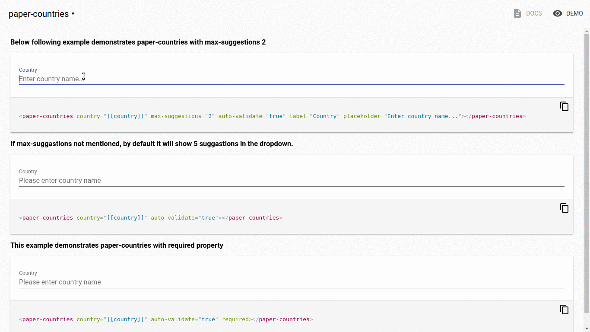

# paper-countries

## About
 paper-countries is a typeahead component based on Polymer; it allows users to select a country from a list. Think of it as a fun and interactive version of the select input field. We at Blue Water Tracks developed it because we were bored with the usual dropdowns selects fields and wanted to something that was fun using Polymer.

 Credit goes out to the creators of [flag-icon-css](https://github.com/lipis/flag-icon-css) without which we never would have had those beautiful flags.



## Installation

The element can be installed using bower

    bower install paper-countries

If you want to save it in bower.json file, remember to add flag --save

	bower install --save paper-countries

## Usage

- Following code is required to place in the polymer web component.
```html
	<paper-countries country="[[country]]" auto-validate="true"></paper-countries>
```		
- It is used to select timezone offset from dialog or dropdown.
Check out the [getting started guide](http://bluewatertracks.github.io/paper-contries/components/paper-countries).

## Demo

[Documentation and Demo](http://bluewatertracks.github.io/paper-countries/components/paper-countries/)

To run the demo locally, install using the installation command above and  then, go into the components folder and run ```polymer serve```    

## Contributors

|||
|----------|:-------------:|------:|
|  |  Programming is like playing chess; each line is as important as each step to determine what kind of player or programmer you are. When ever not playing chess, it's Javascript, Java and mongodb.
|  |  Javascript Ninja; saving the world with one line of javascript at a time. ;) 
|  | What is my opinion about JavaScript, NodeJS, MongoDB and Polymer? Building blocks to the future! Allowing me to help make the world a better place.
|


## Pull Requests are welcome
If you feel that you have something that could improve the component, please feel free to send a PR or create an issue with an explaination.

## License

This program is free software: you can redistribute it and/or modify
it under the terms of the GNU General Public License version 3 of the License as published by
the Free Software Foundation.

This program is distributed in the hope that it will be useful,
but WITHOUT ANY WARRANTY; without even the implied warranty of
MERCHANTABILITY or FITNESS FOR A PARTICULAR PURPOSE.  See the
GNU General Public License for more details.
